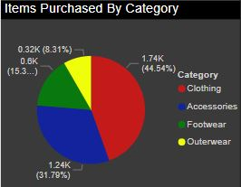

# :department_store: Shopping Trends Project
This project showcases my ability to use PowerBI to create a detailed report and story, created in late 2024.

[Link to Power BI file for Download](https://github.com/Chazzledazzle13/ShoppingTrendsProject/blob/main/ShoppingTrends.pbix)

[Link to Kaggle Data Power BI Project Was Made From](https://www.kaggle.com/datasets/bhadramohit/customer-shopping-latest-trends-dataset)

## Takeaways

1. 3900 individuals were surveyed for this dataset. 68% of those surveyed are men and 32% are women. Those in the 60+ range account for 21.89% of total surveyed. Those in their teens were the lowest percentage, considering only 18 and 19 year olds were included for teens surveyed (4%).

2.  The most common purchase time for customers was during the spring season (25.62%), the least common purchase time was during the summer season (24.49%). Although, there was not a significant variance between when items were purchased. Fall was the most common purchase time for women (26.28%) and spring for men (25.75%).

3.  Out of the 4 main purchase categories (Clothing, Accessories, Footwear, and Outerwear), Clothing was the most purchased item type (44.54%) and Outerwear the least purchased (8.31%).

   

4.  The most common size purchased was medium (45%) and the least common was XL (11%). 

  

5.  The most common purchased colors were olive (4.5%) and yellow (4.5%). The least common purchased color was white (3.6%). For men, the most popular color was silver (4.6%) and for women the most popular color was yellow (4.8%).

  

6. Clothing accounted for 104k of the total spend, outerwear was the lowest at 19k.
   
  

7. 43 % of customers applied a discount.

  

8. 27 % of customers were subscribed to a premium membership.

  

9. Most common shipping type is "Free Shipping" (17.31%) and least common is the "2-Day Shipping" option (16.08%).

  

10. Customers stated they most often purchase "Every 3 Months".

  

11. With 5 being the highest rating, the average rating on goods is 3.75.

  

12. Customers most often used their credit card to purchase (17.8%). The least common payment types were bank transfer and debit card (both 16.2% respectively).

  

13. Customers stated they mostly prefer paying with Paypal (17.4%).

  
